---
languages:
  - python
products:
  - Azure Machine Learning Service
description: "Responsible AI 2020"
---


# Responsible AI 2020 - Detect if a patient needs treatment based on heart-disease data

# Introduction

This repository wishes to show how using the latest machine learning features in Azure Machine Learning and Microsoft open-source toolkits we can put the responsible AI principles into practice.
These tools empower data scientists and developers to understand ML models, protect people and their data, and control the end-to-end ML process. 

For this, we will develop a solution that wishes to detect if a person is suitable for receiving treatment for heart disease or not. We will use a dataset that will help us classify patients that have heart disease from those that doesn’t. Using this example, we will show how to ensure ethical, transparent and accountable use of AI in a medical scenario.

This example ilustrates how to put the responsible AI principles into practice throughout the different stages of Machine Learning pipeline (Preprocessing, Training/Evaluation, Register Model).

Within this repository, you will find all the resources needed to create and simulate a medical scenario using Azure Machine Learning Service with Responsible AI techniques such as:

1. [Differential Privacy](https://github.com/opendifferentialprivacy)
2. [FairLearn](https://github.com/fairlearn/fairlearn)
3. [InterpretML](https://docs.microsoft.com/en-us/azure/machine-learning/how-to-machine-learning-interpretability)
4. [DataDrift](https://docs.microsoft.com/en-us/azure/machine-learning/how-to-monitor-data-drift)

> **The goal of this project is to detect if a person is suitable for receiving a treatment for heart disease.**

# Objectives

- Understand how Responsible AI techniques work.
- Use Azure Machine learning Service to create a Machine Learning Pipeline with these Responsible AI techniques.
- Prevent data exposure with differential privacy.
- Mitigate model unfairness.
- Interpret and explain models.

# Why use Azure Machine Learning Service?

Azure Machine Learning Service give to use the capability to use MLOps techniques, it empowers data scientists and app developers to help bring ML models to production.

This MLOps functionalities that Azure Machine Learning have, enables you to track / version / audit / certify / re-use every asset in your ML lifecycle and provides orchestration services to streamline managing this lifecycle.


## What are the key challenges we wish to solve with MLOps?


**Model reproducibility & versioning**

- Track, snapshot & manage assets used to create the model
- Enable collaboration and sharing of ML pipelines

**Model packaging & validation**

- Support model portability across a variety of platforms
- Certify model performance meets functional and latency requirements

**Model auditability & explainability**

- Maintain asset integrity & persist access control logs
- Certify model behavior meets regulatory & adversarial standards

**Model deployment & monitoring**

- Release models with confidence
- Monitor & know when to retrain by analyzing signals such as data drift

if you want to know more about how we have implemented the machine learning workflow using Azure Machine Learning Studio, please, see the following [file](docs/ResponsibleAI_Presentation.pdf)


# Understanding (InterpretML)


As ML integrates deeply into our day-to-day business processes, transparency is critical. Azure Machine Learning helps not only to understand model behavior, but also to assess and mitigate bias.

Interpretation and model’s explanation in Azure Machine Learning is based on the InterpretMLtoolset. It helps developers and data scientists to understand the models’ behavior and provide explanations about the decisions made during the model’s inference. Thus, it provides transparency to customers and business stakeholders.

Use model interpretation capability to:

1. **Create accurate ML models.**

2. **Understand the behavior of a wide variety of models, including deep neural networks, during the learning and inference phases.**

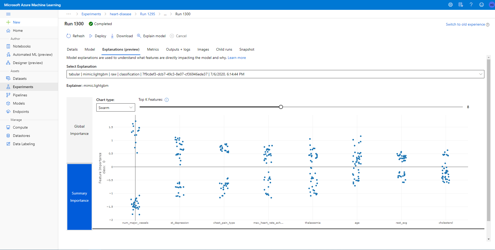

3. **Perform conditional analysis to determine the impact on model predictions when characteristic values are changed.**

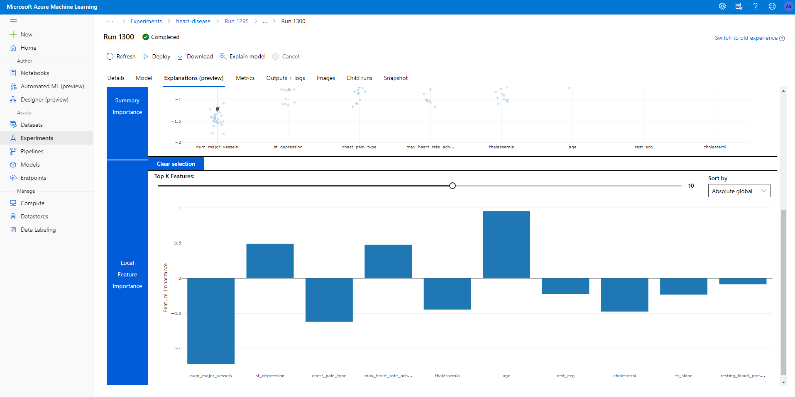

## Evaluation and mitigation of model bias (FairLearn)

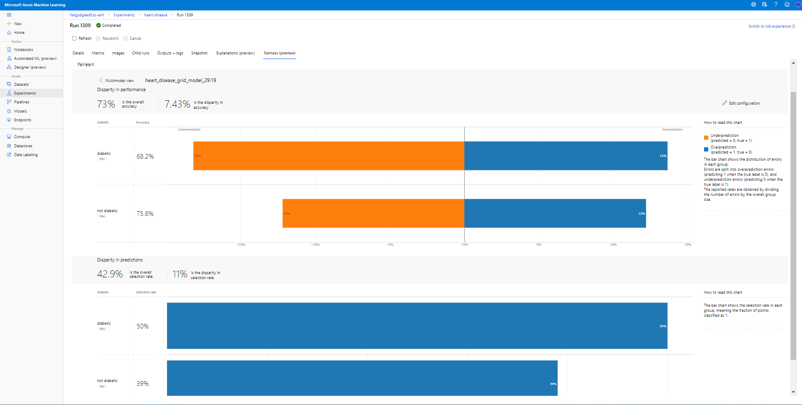

Today, a challenge with the creation of artificial intelligence systems is the inability to prioritize impartiality. By using Fairlearn with Azure Machine Learning,developers and data scientists can leverage specialized algorithms to ensure more unbiased results for everyone.

Use impartiality capabilities to:

1. **Evaluate the bias of models during learning and implementation.**

2. **Mitigate bias while optimizing model performance.**

3. **Use interactive visualizations to compare a set of recommended models that mitigate bias.**


# Protection (Differential Privacy)

|                                                     |                                                     |     |
| :-------------------------------------------------: | :-------------------------------------------------: | :-: |
|  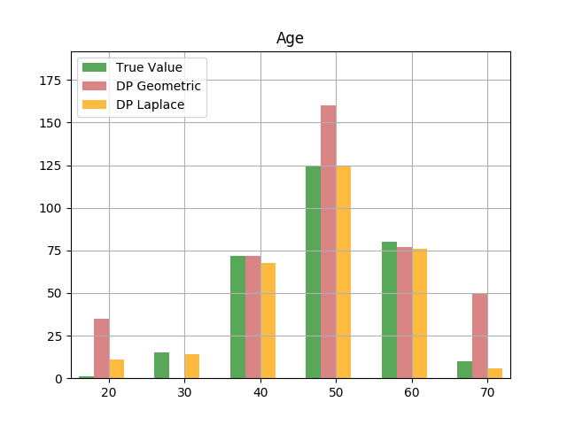  |  |
|  | 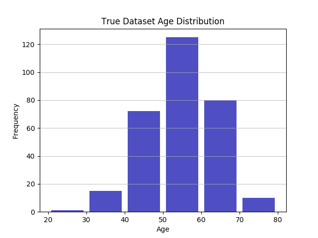 |
| 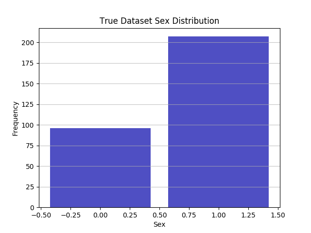 | 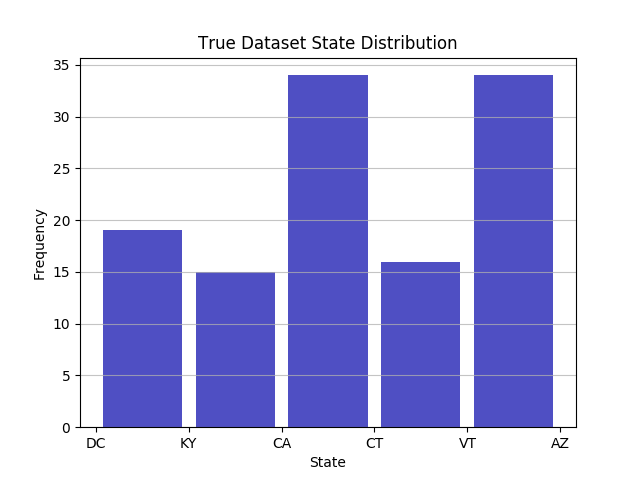 |

ML is increasingly used in scenarios that encompass sensitive information, such as census and patient medical data. Current practices, such as writing or masking data, may be limiting ML. To address this issue, confidential machine learning and differential privacy techniques can be used to help organizations create solutions while maintaining data privacy and confidentiality.

## Avoid data exposure with differential privacy

By using the new Differential Privacy Toolkit with Azure Machine Learning,data science teams can create ML solutions that preserve privacy and help prevent the re-identification of a person's data. These differential privacy techniques have been developed in collaboration with researchers from the Institute of Quantitative Social Sciences (IQSS) and the Harvard School of Engineering.

Differential privacy protects sensitive information with:

1. **Statistical noise injection into the data to help prevent the disclosure of private information, without a significant loss of accuracy.**

2. **Exposure risk management with budget monitoring for information used in individual consultations and with greater limitation of consultations, as appropriate.**

## Data protection with sensitive machine learning

In addition to data privacy, organizations seek to ensure the security and confidentiality of all ML resources.

To enable deployment and learning of secure models, Azure Machine Learning provides a robust set of network and data protection capabilities. This includes support for Azure virtual networks, private links to connect to machine learning workspaces, dedicated compute hosts, and client managed keys for encryption in transit and at rest.

On this secure basis, Azure Machine Learning also enables Microsoft data science teams to build models with sensitive data in a secure environment, without the ability to view data. The confidentiality of all machine learning resources is preserved during this process. This approach is fully compatible with open source machine learning frameworks and a wide range of hardware options. We are pleased to offer these confidential machine learning capabilities to all developers and data scientists later this year.

# Control (Data Drift)

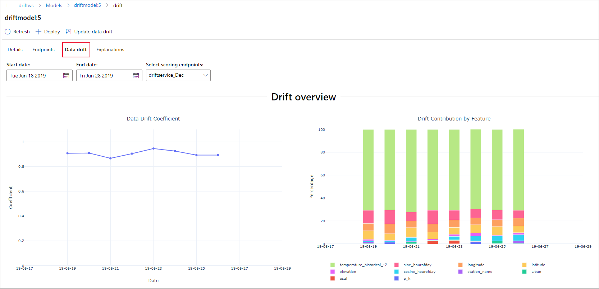

To build responsibly, the ML development process must be repeatable, reliable, and responsible to stakeholders. Azure Machine Learning enables decision makers, auditors, and all ML lifecycle members to support a responsible process.

## Tracking ML resources through audit logs

Azure Machine Learning provides capabilities to automatically track lineage and maintain an audit trail of ML resources. Details such as execution history, learning environment, and explanations of data and models are captured in a central log, allowing organizations to meet various auditing requirements.

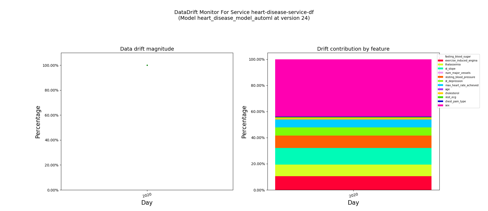

## Brief explanation of used Azure Machine Learning Services

| Technology                     | Description                                                                                                                          |
| ------------------------------ | ------------------------------------------------------------------------------------------------------------------------------------ |
| Azure Machine Learning Service | Cloud services to train, deploy and manage machine learning models                                                                   |
| AutoML                         | Process of automating the time consuming, iterative tasks of machine learning model development                                      |
| Differential Privacy           | Process of protecting personal information and users identity                                      |
| Interpret ML                   | Interpret a model by using an explainer that quantifies the amount of influence each feature contribues to the predicted label       |
| FairLearn                      | Python package that empowers developers of AI systems to assess their system's fairness and mitigate any observed unfairness issues. |
| DataDrift                      | Data drift is the change in model input data that leads to model performance degradation                                             |

## Final Result Azure Machine Learning Pipeline

### Initial Azure Machine Learning Pipeline

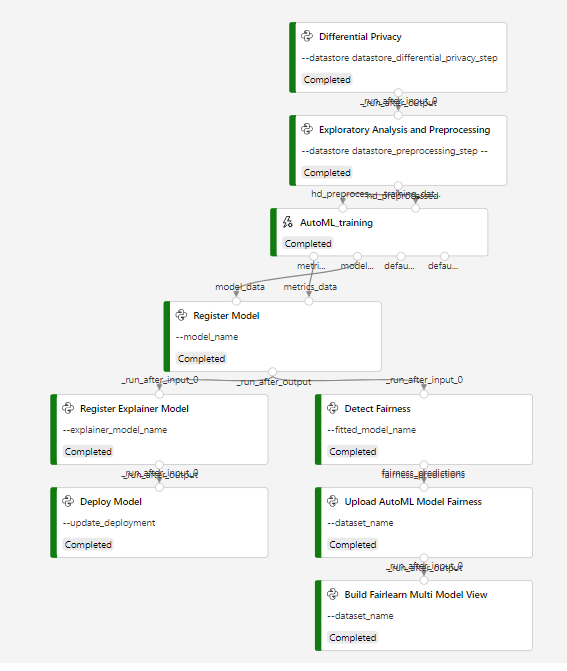

### Re-train Azure Machine Learning Pipeline with new model metrics validation

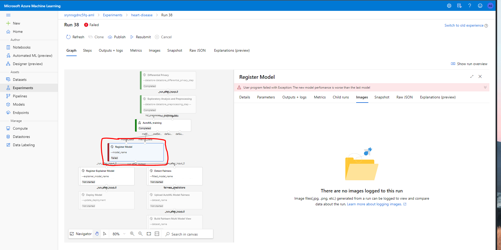

## Understanding the Heart-Disease dataset

This database contains 76 attributes, but all published experiments refer to using a subset of 14 of them. In particular, the Cleveland database is the only one that has been used by ML researchers to this date. The "goal" field refers to the presence of heart disease in the patient. It is integer valued from 0 (no presence) to 1.

Download scratch dataset from: http://archive.ics.uci.edu/ml/datasets/Heart+Disease or https://www.kaggle.com/ronitf/heart-disease-uci

#### Original Columsn Dataset:

  - **age:** age in years
  - **sex:**
    - 0: female
    - 1: male
  - **chest_pain_type:** chest pain type
    - 1: typical angina
    - 2: atypical angina
    - 3: non-anginal pain
    - 4: asymptomatic
  - **resting_blood_pressure:** resting blood pressure (in mm Hg on admission to the hospital)
  - **cholesterol:** serum cholestoral in mg/dl
  - **fasting_blood_sugar:** (fasting blood sugar > 120 mg/dl) (1 = true; 0 = false)
  - **rest_ecg:** resting electrocardiographic results
    - 0: normal
    - 1: having ST-T wave abnormality (T wave inversions and/or ST elevation or depression of > 0.05 mV)
    - 2: showing probable or definite left ventricular hypertrophy by Estes' criteria
  - **max_heart_rate_achieved:** maximum heart rate achieved
  - **exercise_induced_angina:** exercise induced angina (1 = yes; 0 = no)
  - **st_depression:** ST depression induced by exercise relative to rest
  - **st_slope:** the slope of the peak exercise ST segment
    - 1: upsloping
    - 2: flat
    - 3: downsloping
  - **num_major_vessels:** number of major vessels (0-3) colored by flourosopy
  - **thalassemia:**
    - 3 = normal;
    - 6 = fixed defect;
    - 7 = reversable defect
  - **target:** diagnosis of heart disease (angiographic disease status)
    - 0: < 50% diameter narrowing
    - 1: > 50% diameter narrowing

### Attribution:

The authors of the databases have requested that any publications resulting from the use of the data include the names of the principal investigator responsible for the data collection at each institution. They would be:

1. Hungarian Institute of Cardiology. Budapest: Andras Janosi, M.D.
2. University Hospital, Zurich, Switzerland: William Steinbrunn, M.D.
3. University Hospital, Basel, Switzerland: Matthias Pfisterer, M.D.
4. V.A. Medical Center, Long Beach and Cleveland Clinic Foundation:Robert Detrano, M.D., Ph.D.

### Responsible AI Dataset

The dataset we use in this repository is a customized one. In the Getting Started section, we explain how it is generated and which transformations were applied to create our new dataset. The dataset is based on UCI Heart Disease data. The original UCI dataset has by default 76 columns, but Kaggle provides a version containing 14 columns. We used Kaggle one. In this notebook, we'll explore the heart disease dataset.

As part of the exploratory analysis and preprocessing of our data, we have applied several techniques that help us understand the data. The insights discovered (visualizations) were uploaded into an Azure ML Experiment. As part of the study, we took our target variable, and we analyzed it and checked its interaction with other variables.

The original dataset doesn't have any personal o sensible data that we can use it to identify a person or mitigate fairness, just Sex and Age. Therefore, for the purpose of this project and to show the capabilities of Differential Privacy and Detect Fairness techniques, we have created a notebook to generate a custom dataset with the following new columns and schema:

#### Custom colums base on original dataset:

#### Original Columns Dataset:

  - **age (Original)**
  - **sex (Original)**
  - **chest_pain_type: chest pain type (Original)**
  - **resting_blood_pressure (Original)**
  - **cholesterol (Original)**
  - **fasting_blood_sugar (Original)**
  - **rest_ecg (Original)**
  - **max_heart_rate_achieved (Original)**
  - **exercise_induced_angina (Original)**
  - **st_depression (Original)**
  - **st_slope (Original)**
  - **num_major_vessels (Original)**
  - **thalassemia (Original)**
  - **target (Original)**

#### Custom Columns Dataset:

  - **state (custom)**
  - **city (custom)**
  - **address (custom)**
  - **postal code (custom)**
  - **ssn (social security card) (custom)**
  - **diabetic (custom)**
    - 0: not diabetic
    - 1: diabetic
  - **pregnant (custom)**
    - 0: not pregnant
    - 1: pregnant
  - **ashtmatic (custom)**
    - 0: not ashtmatic
    - 1: ashtmatic
  - **smoker (custom)**
    - 0: not smoker
    - 1: smoker
  - **observations (custom)**

To generate the information related to state, address, city, postalcode we have downloaded it from **https://github.com/EthanRBrown/rrad**. From this repository we are able to get a list of real, random addresses that geocode successfully (tested on Google's Geocoding API service). The address data comes from the OpenAddresses project, and all the addresses are in the public domain. The addresses are deliberately not linked to people or businesses; the only guarantee is that they are real addresses that geocode successfully.

This *custom dataset* will be the dataset that the Azure ML steps will use. The name that we set to it was "complete_patients_dataset.csv". You can find it on *./dataset*

# Getting started

The solution has this structure:

```
.
├── dataset
│   ├── complete_patients_dataset.csv
│   ├── heart_disease_preprocessed_inference.csv
│   ├── heart_disease_preprocessed_train.csv
│   ├── uci_dataset.csv
│   └── uci_dataset.yml
├── docs (documentation images)
├── infrastructure
│   ├── Scripts
│   │    └── Deploy-ARM.ps1
│   ├── deployment.json
│   ├── DeployUnified.ps1
│   └── README.md
├── src
│   ├── automated-ml (notebook to run AutoML)
│   ├── dataset-generator (notebook to generate dataset)
│   ├── deployment
│   ├── detect-fairness
│   ├── differential-privacy
│   ├── installation-libraries (notebook to install dependecies)
│   ├── mlops-pipeline
│   ├── monitoring
│   ├── notebooks-settings
│   ├── preprocessing
│   ├── retrain
│   └── utils
├── .gitignore
└── README.md
```

To run this sample you have to do this steps:

1. **Create infrastructure**
2. **Run notebook to install dependencies**
3. **Run Dataset Generator Notebook**
4. **Publish the pipeline**
5. **Submit pipeline using API**
6. **Activate Data Drift Detector**
7. **Activate re-train Step**

## 1. Create infrastructure

We need a infrastructure in Azure to run the experiment. You can read more about the necessary infrastructure [here](./infrastructure/README.md).

To facilitate the task of creating the infrastructure, you can run the `infrastructure/DeployUnified.ps1` script. You have to indicate the **Resource Group**, the **Location** and the **Suscription Id**.

The final view of the Azure resource group will be like the following image:

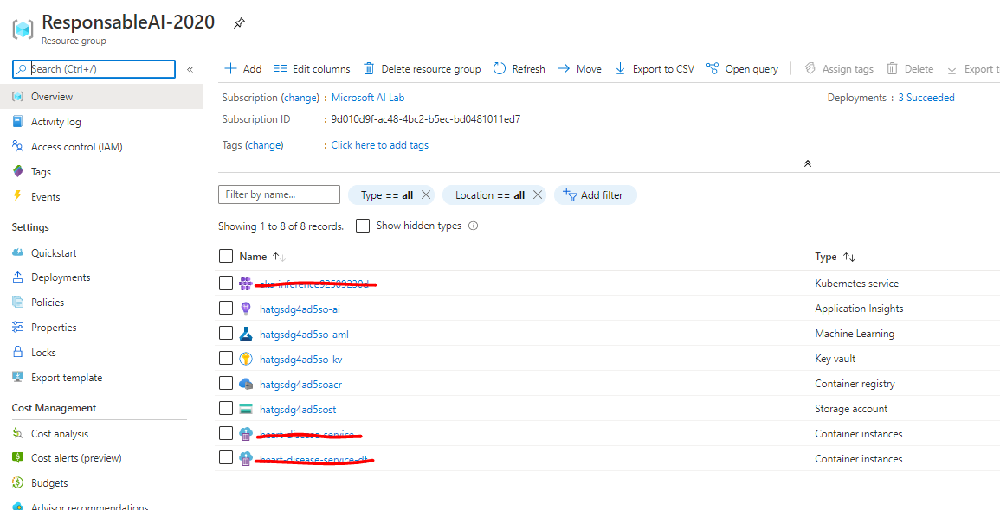

**Note:** The services you see marked with a red line will be created in the next steps. Don't worry about it!

## 2. Install Project dependencies

### Virtual environments to execute Azure Machine Learning notebooks using Visual Studio Codespaces.


This repository contains a labs to help you get started with Creating and deploying Azure machine learning module.

[](https://online.visualstudio.com/environments/new?name=MSLearn-create-deploy-azure-ml-module&repo=leestott/create-ml-workshop-responsibleai)

## Manually creating a VS Online Container

To complete the labs, you'll need the following:

- A Microsoft Azure subscription. If you don't already have one, you can sign up for a free trial at <a href ='https://azure.microsoft.com' target='_blank'>https://azure.microsoft.com</a> or a Student Subscription at <a href ='https://aks.ms/azureforstudents' target='_blank'>https://aka.ms/azureforstudents</a>.

- A Visual Studio Codespaces environment. This provides a hosted instance of Visual Studio Code, in which you'll be able to run the notebooks for the lab exercises. To set up this environment:

    1. Browse to <a href ='https://online.visualstudio.com' target='_blank'>https://online.visualstudio.com</a>
    2. Click **Get Started**.
    3. Sign in using the Microsoft account associated with your Azure subscription.
    4. Click **Create environment**. If you don't already have a Visual Studio Online plan, create one. This is used to track resource utlization by your Visual Studio Online environments. Then create an environment with the following settings:
        - **Environment Name**: *A name for your environment - for example, **MSLearn-create-deploy-azure-ml-module**.*
        - **Git Repository**: leestott/create-deploy-azure-ml-module
        - **Instance Type**: Standard (Linux) 4 cores, 8GB RAM
        - **Suspend idle environment after**: 120 minutes
    5. Wait for the environment to be created, and then click **Connect** to connect to it. This will open a browser-based instance of Visual Studio Code.

Using Azure Machine learning Notebooks 

- Simply download the folder structure and upload the entire content to Azure Machine Learning Notebook 


- You now need to create a new compute instance for your notebook environment 


- You now need to install the AML Prequestites to the Notebook Compute Host, to do this simply open a notebook and then select the open terminal. 


- select the terminal and install all the requirements using pip install 

### Install Responsible AI Requirements 

pip --disable-pip-version-check --no-cache-dir install pylint

pip --disable-pip-version-check --no-cache-dir install numpy 

pip --disable-pip-version-check --no-cache-dir install pandas 

pip --disable-pip-version-check --no-cache-dir 
install ipykernel 

pip --disable-pip-version-check --no-cache-dir install sklearn 

pip --disable-pip-version-check --no-cache-dir install azureml-sdk 

pip --disable-pip-version-check --no-cache-dir install azureml-sdk[auto] 

pip --disable-pip-version-check --no-cache-dir install azureml-widgets 

You can now execute the notebooks successfully 


## Available Notebooks 

In this project we have inside src folder many directories with jupyter notebook that you have to execute to obtain and complete the objective of this repository.
The folder src have:

1. **automated-ml:** automated-ml.ipynb and environment.yml
2. **dataset-generator:** dataset-generator.ipynb and environment.yml
3. **detect-fairness:** fairlearn.ipynb and environment.yml
4. **differential-privacy:** differential-privacy.ipynb and environment.yml
5. **mlops pipelines:**
   1. explain_automl_model_local.ipynb
   2. mlops-publish-pipeline.ipynb
   3. mlops-submit-pipeline.ipynb
   4. environment.yml
6. **monitoring:** datadrift-pipeline.ipynb and environment.yml
7. **preprocessing:** exploratory_data_analysis.ipynb and environment.yml

if your running this on a local machine non devcontainer you execute the following commands before do anything inside these notebooks. For each one do the follwing cmd lines:

- **Conda commands to create local env by environment.yml:** `conda env create -f environment.yml`
- **Set conda env into jupyter notebook:** `python -m ipykernel install --user --name <environment_name> --display-name "Python (<environment_name>)"`

To simplify the installation process, we have created some installation notebooks that when they are runed, they install all the dependencies for MLOps Pipeline Notebooks.

- `src/installation-libraries/installation-differential-privacy.ipynb`
- `src/installation-libraries/Installations.ipynb`

## 3. Run Dataset Generator

Run `src/dataset-generator/dataset-generator.ipynb` to create the project dataset made from UCI Heart-Disease dataset specifically to Responsible AI steps.
See the dataset generated on **./dataset** folder

## 4. Publish the pipeline

Run `src/mlops-pipeline/mlops-publish-pipeline.ipynb` to create a machine learning service pipeline with Responsible AI steps and MLOps techniques that runs jobs unattended in different compute clusters.

You can see the runs pipelines in the Azure portal.

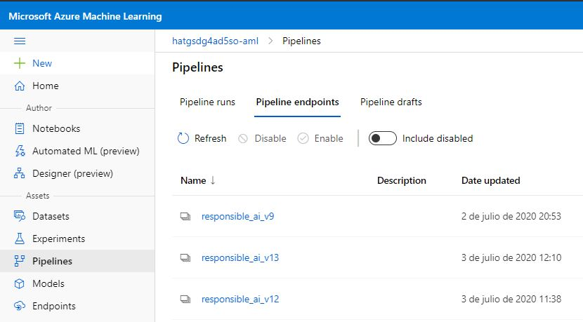

## 5. Submit pipeline using API Rest 

Run `src/mlops-pipeline/mlops-submit-pipeline.ipynb` to execute/invoke this published pipeline via REST endpoint.

You can see the runs pipelines in the Azure portal.

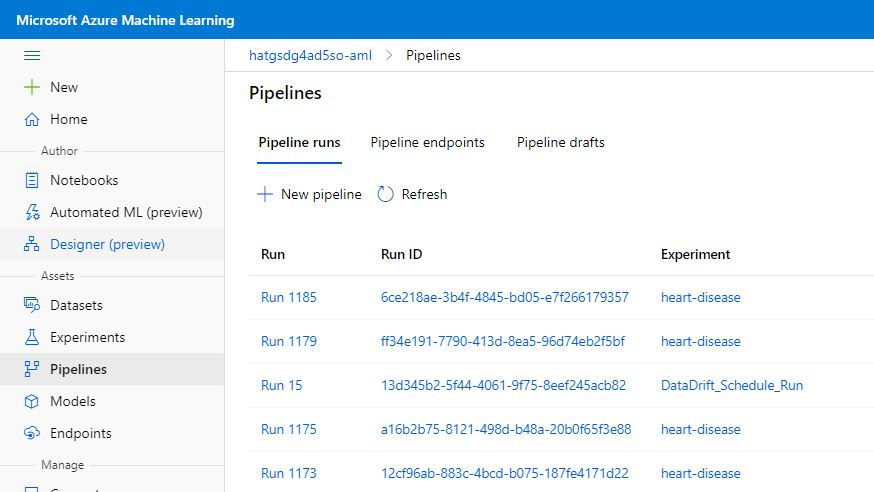

## 6. Activate Data Drift Detector

Run `src/monitoring/datadrift-pipeline.ipynb` to create and execute data drift detector. At the end of this notebook, you will be able to make a request with new data in order to detect drift

Go to Azure ML portal models section. In the details tab now you can see a new section about Data Drift Detector status and configuration.

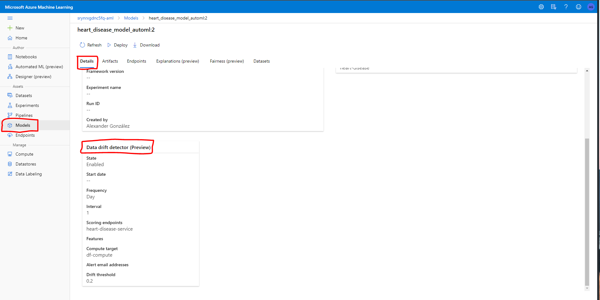

## 7. Execute pipeline with retrain configuration

If Data Drift coefficient is greater than the configured threshold a new alert will be send to the final user. In that moment, the user will can execute the re-train pipeline in order to improve the performance of the model taking into account the new collected data.

Go to Azure ML Portal Pipelines section. Click on the last pipeline version. Then, you will have to click on submit button. Now, you should see something like the following image:

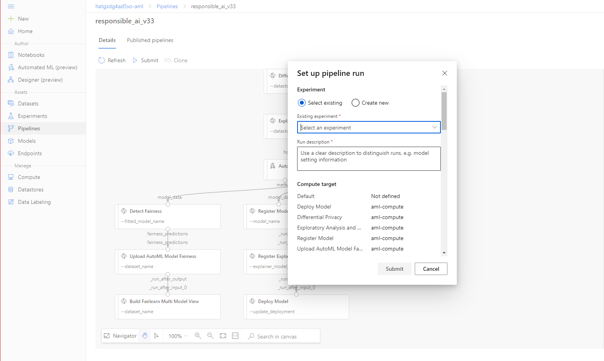

First, select an existing experiment or create a new one for this new pipeline execution.
Finally, in the same view, to do the retrain process correctly some parameters have to change:

1. **use_datadrift** = False
2. **retrain_status_differential_privacy_step** = True
3. **retrain_status_preprocessing_step** = True
3. **update_deployment_deploy_step** = True

Once the parameters were setted we have everything ready to execute the retraining process!


# References

- [Azure Machine Learning(Azure ML) Service Workspace](https://docs.microsoft.com/en-us/azure/machine-learning/service/overview-what-is-azure-ml)
- [Azure ML CLI](https://docs.microsoft.com/en-us/azure/machine-learning/service/reference-azure-machine-learning-cli)
- [Azure Responsible AI](https://azure.microsoft.com/es-es/blog/build-ai-you-can-trust-with-responsible-ml/)
- [Azure ML Samples](https://docs.microsoft.com/en-us/azure/machine-learning/service/samples-notebooks)
- [Azure ML Python SDK Quickstart](https://docs.microsoft.com/en-us/azure/machine-learning/service/quickstart-create-workspace-with-python)
- [Azure ML MLOps Quickstart](https://github.com/Microsoft/MLOps)
- [Azure Machine learning](https://azure.microsoft.com/services/machine-learning)
- [Create development environment for Machine learning](https://docs.microsoft.com/azure/machine-learning/service/how-to-configure-environment)
- [AML Python SDK](https://docs.microsoft.com/azure/machine-learning/service/how-to-configure-environment)
- [AML Pipelines](https://docs.microsoft.com/azure/machine-learning/service/how-to-create-your-first-pipeline)
- [Getting started with Auto ML](https://docs.microsoft.com/azure/machine-learning/service/concept-automated-ml)
- [Intro to AML – MS Learn](https://docs.microsoft.com/en-us/learn/modules/intro-to-azure-machine-learning-service)
- [Automate model select with AML - MS Learn](https://docs.microsoft.com/en-us/learn/modules/automate-model-selection-with-azure-automl)
- [Train local model with AML - MS Learn](https://docs.microsoft.com/en-us/learn/modules/train-local-model-with-azure-mls)

**Tags: Azure Machine Learning Service, Machine Learning, Differential-Privacy, Fairlearn, MLOPs, Data-Drift, InterpretML**
